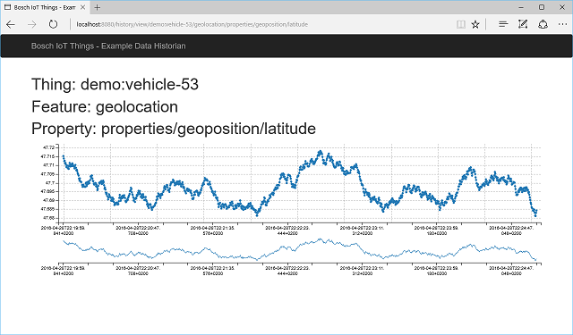

# Bosch IoT Things - Example Data Historian

This example shows how to collect and use data history of property values.
It shows how to collect and store the data in a MongoDB, how to make them accessible via REST and how to present them in a timeseries chart.



# Create a Solution with a private/public key

http://m2m.bosch-si.com/dokuwiki/doku.php?id=002_getting_started:cr_02_booking-cr-service.txt

Add the CRClient.jks to the folder "src/main/resources".

# Configure your Client Id and other settings

Create file "config.properties" in folder "src/main/resources". _Please change the ids._

```
centralRegistryMessagingUrl=wss://events.apps.bosch-iot-cloud.com
clientId=###your solution id ###:historian
keyAlias=CR
keyStorePassword=### your key password ###
keyAliasPassword=### your key alias password ###
http.proxyHost=### your http proxy host, if you need one ###
http.proxyPort=### your http proxy host, if you need one ###
```

# Install and start a local MongoDB

See https://www.mongodb.org/

# Build

```
mvn clean install
```

# Run it

Use the following command to run the example.

```
mvn exec:java -Dexec.mainClass="com.bosch.iot.things.example.historian.Application"
```

# Add ACL for "historian" to your things

Add an ACL for the "historian"-client to any thing you already have. See the inventory-browser and vehicle-simulator examples.

```
{
   ...
   "acl": {
      ...
      "###your solution id ###:historian": {
         "READ": true,
         "WRITE": false,
         "ADMINISTRATE": false
      }
   }
   ...
}
```

# Usage

Use the following URL to look at the collected data:

http://localhost:8080/history/data/###thindId###/###featureId###/###propertyPath###

e.g.
http://localhost:8080/history/data/demo:vehicle-53/geolocation/properties/geoposition/latitude

Use the following URL to view at the collected data as a timeseries chart:

http://localhost:8080/history/view/###thindId###/###featureId###/###propertyPath###

e.g.
http://localhost:8080/history/view/demo:vehicle-53/geolocation/properties/geoposition/latitude


# License

See the cr-examples top level README.md file for license details.
